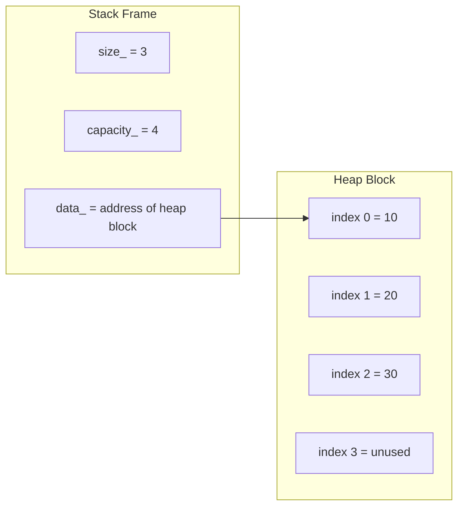
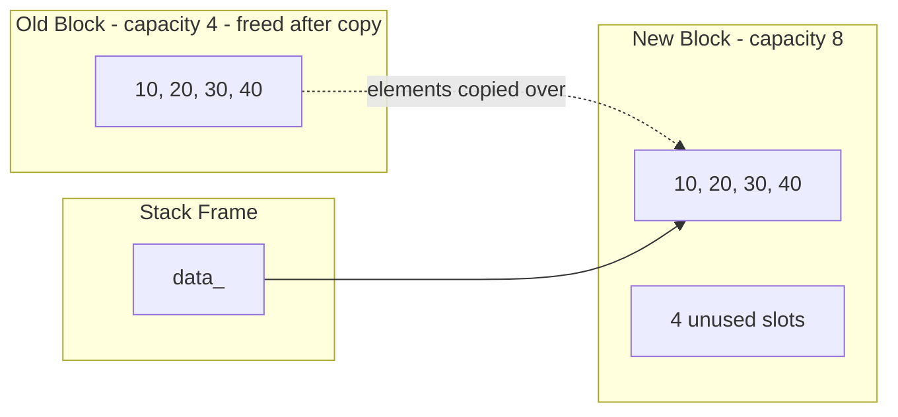
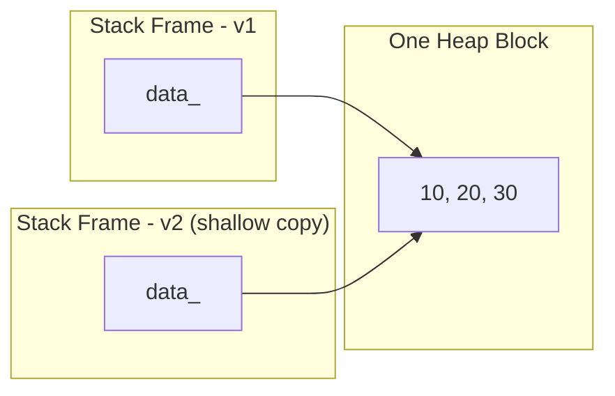
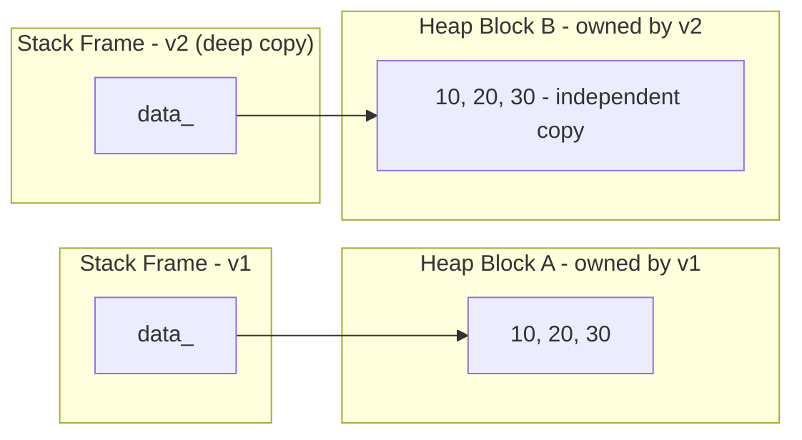
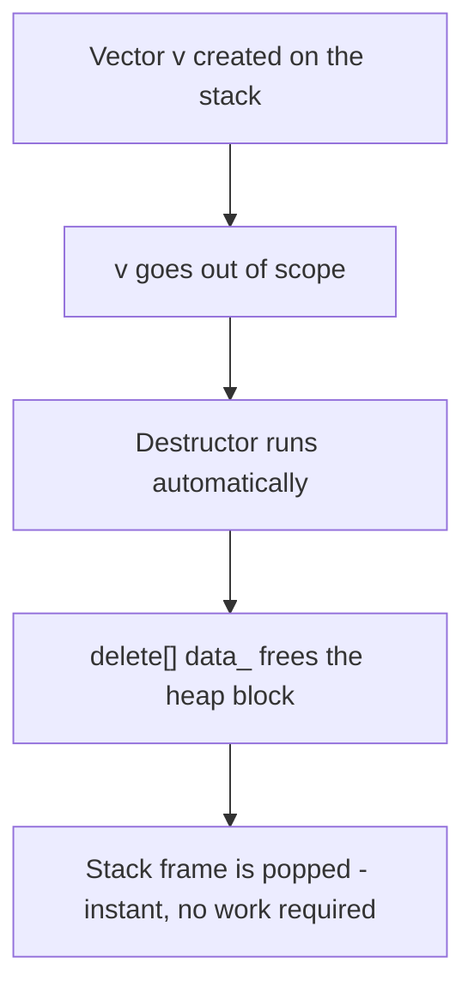

# Custom Vector

A hand-built, templated dynamic array in C++ — no `std::vector`, no shortcuts.

> Part of [Systems Programming From First Principles](../README.md) — the foundation every other project in this repository is built on.

---

## Table of Contents

- [Overview](#overview)
- [Why Build This](#why-build-this)
- [API Reference](#api-reference)
- [Growth Strategy](#growth-strategy)
- [Stack vs Heap](#stack-vs-heap)
- [Implementation](#implementation)
- [Rule of Three](#rule-of-three)
- [Design Notes and Things to Watch](#design-notes-and-things-to-watch)
- [Concepts Learned](#concepts-learned)
- [The Pain That Forced Each Feature](#the-pain-that-forced-each-feature)
- [Usage Example](#usage-example)
- [Build and Run](#build-and-run)
- [Used By](#used-by)

---

## Overview

A fixed-size C array can't grow. `Vector<T>` solves that by managing a heap-allocated block that doubles in size whenever it fills up, giving amortized O(1) insertion while staying ownership-correct — it follows the Rule of Three so it can be copied, assigned, and destroyed safely, and it can also be built directly from a brace-enclosed list of values.

```cpp
int arr[10];   // what if you need 11? you're stuck.
```

```
Allocate a heap block with some initial capacity.
When size == capacity → allocate a new block twice as large,
copy all elements, delete the old block.
```

## Why Build This

Every project after this one needs a growable, type-generic container:

- The **HashMap** needs a bucket array that can be resized.
- The **Stack** is built directly on top of `Vector<T>`.
- The **VM** needs `Vector<uint8_t>` for bytecode and `Vector<string>` for the constant pool — at the same time.

Reaching for `std::vector` here would skip the entire point: understanding what the standard library is actually doing underneath.

## API Reference

| Method | Signature | Description | Complexity |
|---|---|---|---|
| Default constructor | `Vector()` | Empty vector — no allocation until the first push | O(1) |
| Copy constructor | `Vector(const Vector<T>& other)` | Deep-copies all elements into a new heap block | O(n) |
| Initializer-list constructor | `Vector(const initializer_list<T>& items)` | Reserves exact capacity up front, then pushes each item | O(n) |
| Copy assignment | `operator=(const Vector<T>& other)` | Frees existing data, deep-copies from `other` | O(n) |
| Destructor | `~Vector()` | Frees the heap-allocated array | O(1) |
| `push_back` | `void push_back(T val)` | Appends a value, triggers `resize()` if full | Amortized O(1) |
| `pop_back` | `T pop_back()` | Removes and returns the last element | O(1) |
| `operator[]` | `T& operator[](int index)` | Reference to the element at `index` — not `const`-qualified | O(1) |
| `size` | `size_t size()` | Element count — not `const`-qualified | O(1) |
| `capacity` | `size_t capacity()` | Allocated capacity — not `const`-qualified | O(1) |
| `clear` | `void clear()` | Explicitly destroys each live element, resets size to 0 | O(n) |
| `inspect` | `void inspect()` | Prints the address and value of every stored element | O(n) |

**Private helpers**

| Method | Signature | Description | Complexity |
|---|---|---|---|
| `resize` | `void resize()` | Doubles capacity (or sets it to 1 if empty), copies, frees old block | O(n) |
| `reserve` | `void reserve(size_t newCap)` | Grows to an exact requested capacity, if larger than current | O(n) |

**Type aliases**

```cpp
using value_type      = T;
using reference       = T&;
using const_reference = const T&;
```

This mirrors the STL container convention (`std::vector<T>::value_type`, etc.) — useful if `Vector<T>` ever needs to work with generic, STL-style algorithms.

## Growth Strategy

Capacity doubles rather than incrementing by a fixed amount, which is what makes `push_back` amortized O(1) instead of O(n) per call:

| Pushes so far | Capacity | Reallocation happens? |
|---|---|---|
| 0 | 0 | — |
| 1 | 1 | yes (0 → 1) |
| 2 | 2 | yes (1 → 2) |
| 3–4 | 4 | yes at push 3 (2 → 4) |
| 5–8 | 8 | yes at push 5 (4 → 8) |
| 9–16 | 16 | yes at push 9 (8 → 16) |

`reserve()` exists specifically to skip this ladder when the final size is already known — the initializer-list constructor calls `reserve(items.size())` once up front instead of doubling repeatedly while pushing each item.

## Stack vs Heap

`Vector<T>` exists specifically because these two regions of memory behave completely differently. Before looking at growth or copying in code, it helps to see the actual split.

### The Fundamentals

| | Stack | Heap |
|---|---|---|
| Managed by | Compiler, automatically | You, manually — `new[]` / `delete[]` |
| Lifetime | Tied to scope — freed the instant a function returns | Lives until something explicitly frees it |
| Allocation speed | Extremely fast — just moves a pointer (`rsp`) | Slower — the allocator has to find a free block |
| Size | Fixed at compile time, limited to a few MB | Flexible, limited only by available RAM |
| What `Vector<T>` puts here | `size_`, `capacity_`, and the `data_` pointer itself | The actual array of `T` elements `data_` points to |

The core idea: **the `Vector` object is small and lives on the stack, but the data it holds can grow arbitrarily large on the heap.** Only a pointer — a single address — crosses that boundary.

### Anatomy of a Single Vector



`v`'s three member variables live in the current stack frame — the same frame you'd see building up around `rsp`/`rbp` in GDB. `data_` is nothing special at the machine level: it's just an 8-byte value sitting in that frame that happens to hold an address. Everything the `Vector` actually stores lives elsewhere, on the heap, reachable only by following that one pointer.

### What resize() Actually Does



The old block isn't grown in place — it can't be, since something else might already occupy the memory right after it. `resize()` allocates a brand-new, larger block, copies every element across, repoints `data_` at the new block, and frees the old one. This is why a reallocating `push_back` costs O(n), and why doubling capacity — rather than growing by a fixed amount — keeps the *amortized* cost O(1): reallocations get exponentially rarer as `n` grows.

### Shallow Copy: The Bug



Without a user-defined copy constructor, `Vector v2 = v1;` would just copy the three member variables bit for bit — `data_` included. Both `v1` and `v2` now hold the *same* address. Neither owns the block exclusively. When both go out of scope, both destructors call `delete[]` on that same address — the second call is a double-free.

### Deep Copy: The Fix



The copy constructor and copy assignment operator allocate a fresh block and copy the values across instead of copying the pointer. `v1` and `v2` now own independent memory: modifying one never touches the other, and each destructor frees only the block it actually owns.

### What Happens at Scope Exit



This asymmetry is the whole reason the destructor exists. Popping a stack frame is free — the compiler just moves a pointer back. But the heap block `data_` points to doesn't get cleaned up by that; leaving it behind would be a leak. The destructor exists to tie heap cleanup to something the compiler already does for you automatically, so a `Vector` going out of scope cleans up completely without you having to remember to call anything.

---

## Implementation

```cpp
#pragma once
#include <iostream>
#include <initializer_list>
using namespace std;

template<typename T>
class Vector {
private:
    using  value_type      = T;
    using  reference       = T&;
    using  const_reference = const T&;
    size_t size_;
    size_t capacity_;
    value_type* data_;

    void resize() {
        size_t newCap_ = capacity_ == 0 ? 1 : capacity_ * 2;
        value_type* newdata_ = new value_type[newCap_];
        for (size_t i {}; i < size_; ++i) {
            newdata_[i] = data_[i];
        }
        delete[] data_;
        data_ = newdata_;
        capacity_ = newCap_;
    }

    void reserve(size_t newCap_) {
        if (newCap_ <= capacity_) return;
        value_type* newdata_ = new value_type[newCap_];
        if (data_ != nullptr) {
            for (size_t i{}; i < size_; ++i) newdata_[i] = data_[i];
        }
        delete[] data_;
        data_ = newdata_;
        capacity_ = newCap_;
    }

public:
    Vector() : data_(nullptr), size_(0), capacity_(0) {};

    Vector(const Vector<value_type>& other) : size_(other.size_), capacity_(other.capacity_) {
        data_ = new T[capacity_];
        for (size_t i {}; i < size_; ++i) {
            data_[i] = other.data_[i];
        }
    }

    Vector(const initializer_list<value_type>& items) : size_(0), capacity_(0), data_(nullptr) {
        reserve(items.size());
        for (auto& item : items) {
            push_back(item);
        }
    }

    Vector& operator=(const Vector<value_type>& other) {
        if (this == &other) return *this;
        delete[] data_;
        size_ = other.size_;
        capacity_ = other.capacity_;
        data_ = new value_type[capacity_];
        for (size_t i {}; i < size_; ++i) {
            data_[i] = other.data_[i];
        }
        return *this;
    }

    ~Vector() {
        // clear();
        delete[] data_;
    }

    void push_back(value_type val) {
        if (size_ == capacity_) resize();
        data_[size_++] = val;
    }

    value_type pop_back() {
        if (size_ == 0)
            throw std::out_of_range("pop_back on empty Vector");
        value_type val = data_[size_ - 1];
        size_--;
        return val;
    }

    reference operator[](int index) {
        return data_[index];
    }

    void clear() {
        if (size_ == 0) return;
        for (size_t i {}; i < size_; ++i) {
            data_[i].~value_type();
        }
        size_ = 0;
    }

    size_t capacity() {
        return capacity_;
    }

    size_t size() {
        return size_;
    }

    void inspect() {
        value_type* ptr = data_;
        if (ptr != nullptr) {
            for (size_t i {}; i < size_; ++i) {
                cout << "Address: " << ptr + i << " -> Value: " << *(ptr + i) << endl;
            }
        }
    }
};
```

## Rule of Three

See [Shallow Copy: The Bug](#stack-vs-heap) and [Deep Copy: The Fix](#stack-vs-heap) above for what this actually looks like in memory.

If a class manages a raw resource (here, a `new[]`-allocated block), the compiler-generated defaults for the copy constructor and copy assignment operator do a **shallow copy** — they copy the pointer, not the data. Two `Vector` objects end up pointing at the same heap block, and when both destructors run, `delete[]` fires twice on the same address: a double-free.

The fix is defining all three together:

```
Destructor          — frees owned memory
Copy constructor     — allocates a NEW block and copies values into it
Copy assignment      — frees existing memory, then does the same
```

Define one, and you almost certainly need the other two.

## Design Notes and Things to Watch

- **`using namespace std;` in the header.** It pollutes the global namespace of every translation unit that includes `CustomVector.h`. Harmless in a solo learning project, but worth dropping (`std::` qualify inline, or scope the `using` to the `.cpp`) before this header is ever shared or included alongside other code.
- **`clear()` vs the destructor.** `clear()` explicitly calls `data_[i].~value_type()` on every live element. But `delete[] data_` in the destructor still invokes the compiler-generated array delete, which destroys *every* element in the originally allocated block — including ones `clear()` already destructed. For `int` this is invisible, since there's no user-defined destructor to double-invoke. For a non-trivial `T` (`std::string`, or another class with real resources), this double-destructs already-cleared elements. That's almost certainly why `clear();` is commented out of the destructor rather than called — but it means `clear()` itself is only fully safe today because `T = int`.
- **`push_back` after `clear()`.** Same root cause: `data_[size_++] = val;` assigns into a slot whose object was explicitly destructed rather than reconstructing it. Fine for POD types like `int`; undefined behavior for non-trivial `T`.
- **Const-correctness.** `size()`, `capacity()`, and `operator[]` aren't `const`-qualified, so a `const Vector<T>&` parameter can't call any of them. Worth adding `const` overloads once this needs to be passed around by const reference.

## Concepts Learned

| Concept | How It Was Learned |
|---|---|
| Dynamic memory allocation | `new[]` / `delete[]` for growing arrays |
| Heap vs stack | Array on heap survives function scope |
| Amortized O(1) push | Why `capacity *= 2` and not `+= 1` |
| Shallow copy | Compiler default — copies pointer, not data |
| Double-free | Shallow copy destructor called twice → crash |
| Deep copy | Allocate new block, copy values, own the memory |
| Rule of Three | Destructor + copy constructor + copy assignment |
| Unsigned underflow | `size_t` at 0 minus 1 → wraps to max value |
| Stack overflow guard | `throw out_of_range` on empty pop |
| Template classes | `template<typename T>` — blueprint, not code |
| `reserve` vs `resize` | Exact target capacity vs doubling strategy |
| `initializer_list` construction | Building a container from `{1, 2, 3}` syntax |
| Type aliases | `value_type` / `reference` — STL container convention |
| Explicit destructor calls | `data_[i].~value_type()` — manual lifetime management |
| Const-correctness | Non-`const` accessors block use through `const` references |

## The Pain That Forced Each Feature

- A fixed array that couldn't grow forced `push_back` + `resize`.
- `size_ - 1` at `size_ == 0` underflowed (`size_t` is unsigned) and crashed — forcing an `out_of_range` guard in `pop_back`.
- Passing a `Vector` by value into a `load()` function caused a double-free at scope exit — forcing the Rule of Three.
- Needing `Vector<uint8_t>` and `Vector<string>` at the same time for the VM forced templates instead of a hardcoded `int` container.
- Building a `Vector` from a known set of values one `push_back` at a time triggered several wasteful reallocations — forcing `reserve()` and the `initializer_list` constructor to allocate the right capacity once.

## Usage Example

```cpp
#include "CustomVector.h"

int main() {
    Vector<int> v = {10, 20, 30, 40, 50};   // initializer_list constructor

    v.inspect();
    // Address: 0x... -> Value: 10
    // Address: 0x... -> Value: 20
    // Address: 0x... -> Value: 30
    // Address: 0x... -> Value: 40
    // Address: 0x... -> Value: 50

    cout << v[2] << "\n";              // 30
    cout << v.pop_back() << "\n";      // 50, size now 4

    Vector<int> copy = v;              // deep copy, Rule of Three
    copy.push_back(999);

    cout << v.size() << " vs " << copy.size() << "\n"; // 4 vs 5

    v.clear();
    cout << v.size() << "\n";          // 0 — capacity is unchanged

    return 0;
}
```

## Build and Run

```bash
g++ main.cpp -o vector_demo -I"path/to/CPP/" -std=c++17
./vector_demo
```

## Used By

- **Custom HashMap** — bucket array management
- **Custom Stack** — `push` / `pop` / `peek` delegate straight to `Vector<T>`
- **Bytecode VM** — `Vector<uint8_t>` for the instruction stream, `Vector<string>` for the constant pool
